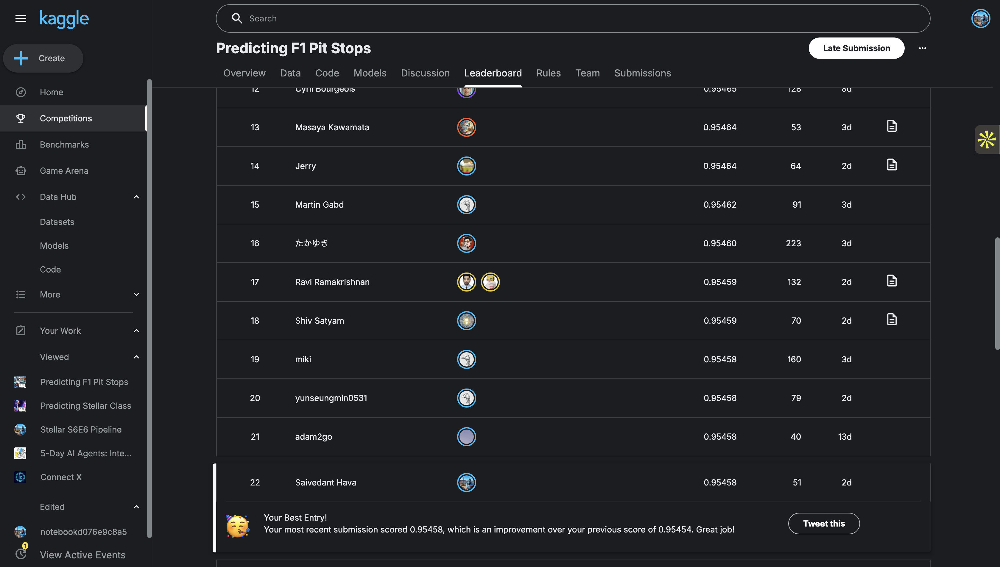
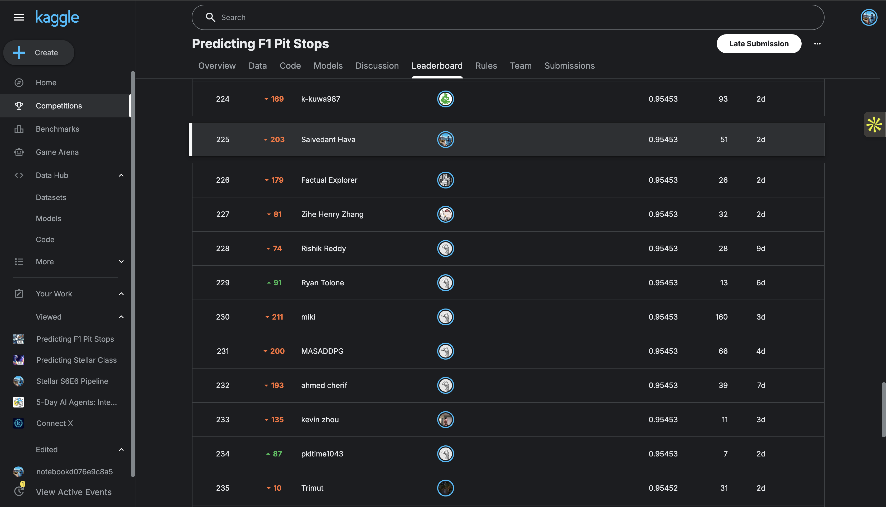

# Predicting F1 Pit Stops (Kaggle Playground Series S6E5)

Binary classification. Predict P(PitNextLap=1) for each lap. Metric is ROC AUC.

## Result

| Stage | AUC | Rank |
|---|---|---|
| Prior best | 0.95450 | ~375 |
| Public (this submission) | 0.95458 | 22 |
| Private (final) | 0.95453 | 225 of 3000+ |

Public leaderboard, 0.95458 at rank 22:



Final private leaderboard after the competition closed, 0.95453 at rank 225. The 0.95458 public score sat in a tight cluster, so the private split reshuffled it down to 225, still inside the top 8%.



## What moved the needle

Most public submissions sit at exactly 0.95454. It is basically one community blend that everyone re-uploads, so a few hundred teams tie at that score. Averaging more of those public files together does not help, it pulls the score back down, because they all agree with each other already.

The thing that worked: train a separate model on the original real F1 dataset that the synthetic competition data was generated from ([aadigupta1601/f1-strategy-dataset-pit-stop-prediction](https://www.kaggle.com/datasets/aadigupta1601/f1-strategy-dataset-pit-stop-prediction)). Its predictions barely line up with the public blends (rank correlation around 0.915, versus about 0.97 for other gradient boosting models), but the signal is clean. Mixing in a small slice of it fixes ranking mistakes in the anchor instead of smoothing them away.

```
final = 0.95 * rank(raunak_public_best) + 0.05 * rank(orig_data_model)
#  weight 0.00 (raunak raw) -> 0.95454
#  weight 0.05 (this)       -> 0.95458   (peak)
#  weight 0.10              -> 0.95452
```

## Why it works

The synthetic labels are sampled from the same conditional P(y given x) that the original data follows. A model fit on the clean original gives an independent read on that conditional, so it does not collapse into the same predictions everyone else's gradient boosting models make. When the top scores are packed into a tiny range, that independence is what buys the extra 0.00004.

## How the original model was built

LightGBM on the original dataset's raw columns: LapNumber, Stint, TyreLife, Position, LapTime, LapTime_Delta, Cumulative_Degradation, RaceProgress, Position_Change, PitStop, plus categorical Driver, Compound, Race, Year. Settings were lr 0.03, num_leaves 64, 600 rounds. Take its test predictions, rank them, blend 95/5 with the strongest public submission.

## Compute

Everything ran on a MacBook Air M1 with 8 GB RAM, an 8 core CPU and an 8 core GPU. No cloud. LightGBM, XGBoost and CatBoost all trained on CPU.

## Notes

- No data leak here. Train and test never share a (Driver, Race, Year, LapNumber) row, and matching test rows to the original by label alone only reaches 0.675 AUC.
- A single honest model on this data tops out near 0.951.
- Submission cap is 10 per day, resets at 00:00 UTC. Final scoring uses 2 submissions you pick yourself.

## Files

- O2.csv: the 0.95458 submission.
